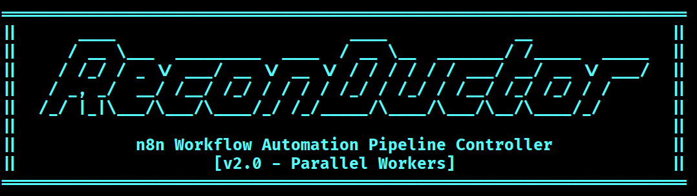

Reconductor is a multi-phase reconnaissance automation system that orchestrates subdomain enumeration, live host validation, and vulnerability scanning using n8n workflows with parallel execution capabilities.

---

## Features

- **Phase 1: Subdomain Enumeration** - Discover subdomains using crt.sh and subfinder
- **Phase 2: Live Host Validation** - Validate live hosts with httpx, dnsx, and technology fingerprinting
- **Phase 3: Vulnerability Scanning** - Parallel nuclei scanning with WAF-safe rate limiting
- **Incremental Scanning** - Smart subdomain deduplication prevents re-scanning of previously validated hosts
- **True Parallel Architecture** - 5-worker pool with IP-centric sharding for 6-9x speed improvement
- **WAF-Safe Scanning** - Intelligent rate limiting and IP clustering to avoid detection
- **Python Orchestrator** - Interactive CLI for managing the reconnaissance pipeline

---

## Quick Start

### Prerequisites

- n8n instance running on `http://localhost:5678`
- Python 3.6+
- Reconnaissance tools (subfinder, httpx, dnsx, nuclei)

### Installation

```bash
# Install dependencies
pip install requests

# Make orchestrator executable
chmod +x recon_orchestrator.py

# Import n8n workflows
# See docs/getting-started/INSTALLATION.md for detailed setup instructions
```

### Basic Usage

```bash
# Run the orchestrator
./recon_orchestrator.py

# Select operation mode:
# [1] Full Scan (Phase 1 -> 2 -> 3)
# [2] Discovery Only (Phase 1 -> 2)
# [3] Vuln Scan Only (Phase 3 Parallel)
```

---

## Architecture

### Workflow Pipeline

```
Phase 1: Subdomain Enumeration
    |
    v
Phase 2: Live Host Validation + Tech Fingerprinting
    | (Only NEW subdomains - incremental scanning)
    v
Phase 3: Parallel Vulnerability Scanning (5 Workers)
    |
    v
HTML/JSON Reports
```

### Incremental Scanning Optimization

Reconductor implements intelligent subdomain deduplication to avoid redundant scanning:

- **Master Subdomain Tracking**: All discovered subdomains are stored in `master_subdomains.txt`
- **Automatic Comparison**: Phase 1 compares new findings against the master list using `anew`
- **Only New Hosts Validated**: Phase 2 only processes subdomains not present in the master list
- **Time & Resource Savings**: Re-running scans on the same domain skips previously validated hosts

**File Location**: `/tmp/recon/{domain}/master_subdomains.txt`

**How It Works**:
1. Phase 1 discovers subdomains via crt.sh and subfinder
2. New subdomains are compared against `master_subdomains.txt`
3. Only unique subdomains are passed to Phase 2 for validation
4. The master list is automatically updated with new findings

### Phase 3 Parallel Architecture

Phase 3 uses a **true parallel execution model** with IP-centric sharding:

1. **IP-Centric Sharding** - Groups hosts by IP address to prevent WAF blocks
2. **Fixed 5-Worker Pool** - Maximum 5 concurrent nuclei scans
3. **Fire-and-Forget Workers** - Independent sub-workflow executions
4. **Marker-Based Synchronization** - Manager polls for worker completion
5. **WAF-Safe Rate Limits** - 15 requests/second per worker

```
Manager Workflow
    |
    ├── Worker 1 (IP Cluster 1) --> nuclei scan --> completion marker
    ├── Worker 2 (IP Cluster 2) --> nuclei scan --> completion marker
    ├── Worker 3 (IP Cluster 3) --> nuclei scan --> completion marker
    ├── Worker 4 (IP Cluster 4) --> nuclei scan --> completion marker
    └── Worker 5 (IP Cluster 5) --> nuclei scan --> completion marker
    |
    v
Aggregate Results --> Generate Report
```

---

## Output Structure

All results are stored in `/tmp/recon/{domain}/`:

```
/tmp/recon/example.com/
├── master_subdomains.txt         # Master list of all discovered subdomains
├── phase2_data.json              # Live hosts with IPs + tech
├── phase2_report.html            # Live host validation report
├── phase3_report.html            # Final vulnerability report
├── phase3_data.json              # All findings in JSON format
├── phase3_all_results.jsonl      # Raw nuclei results
└── phase3_summary.txt            # Statistics summary
```

---

## Documentation

- [Installation Guide](docs/getting-started/INSTALLATION.md) - Complete setup instructions for all dependencies
- [Usage Guide](docs/getting-started/USAGE.md) - Examples and common use cases
- [Configuration Guide](docs/configuration/CONFIGURATION.md) - Customize paths and settings
- [Workflow Architecture](docs/architecture/WORKFLOWS.md) - Detailed n8n workflow architecture
- [Troubleshooting](docs/guides/TROUBLESHOOTING.md) - Common issues and solutions
- [Contributing](docs/contributing/CONTRIBUTING.md) - How to contribute to the project
- [Documentation Index](docs/INDEX.md) - Complete documentation navigation

---

## Performance

**Benchmark: 300 live hosts**

- **Sequential Scanning**: ~60-90 minutes
- **Parallel Scanning (5 workers)**: ~10-15 minutes
- **Speedup**: 6-9x faster

**Incremental Scanning Benefits**:
- **First Scan**: Full enumeration and validation
- **Subsequent Scans**: Only new subdomains are validated in Phase 2
- **Time Savings**: 50-90% reduction in Phase 2 execution time on re-scans

---

## Webhook Endpoints

| Phase | Endpoint | Purpose |
|-------|----------|---------|
| Phase 1 | `POST /webhook/recon-phase1` | Trigger subdomain enumeration (auto-chains to Phase 2) |
| Phase 2 | `POST /webhook/recon-phase2` | Triggered automatically by Phase 1 |
| Phase 3 | `POST /webhook/recon-phase3-parallel` | Parallel vulnerability scanning |

### Example: Trigger Phase 3 Manually

```bash
curl -X POST http://localhost:5678/webhook/recon-phase3-parallel \
  -H "Content-Type: application/json" \
  -d '{"domain": "example.com"}'
```

---

## Requirements

### System Requirements

- Linux/Unix-based OS (tested on Ubuntu 20.04+)
- 4GB+ RAM recommended
- 10GB+ disk space for results

### Software Requirements

- n8n (v1.0+)
- Python 3.6+
- curl
- jq (optional, for JSON parsing)

### Reconnaissance Tools

- subfinder
- httpx
- dnsx
- nuclei

See [INSTALLATION.md](docs/getting-started/INSTALLATION.md) for detailed installation instructions.

---

## Security Considerations

- **Rate Limiting**: WAF-safe defaults (15 req/s per worker)
- **User-Agent Spoofing**: Mimics legitimate browser traffic
- **IP Clustering**: Prevents multiple workers from hitting same IP simultaneously
- **Template Filtering**: Excludes intrusive/dangerous templates by default
- **Output Security**: All results stored locally in `/tmp/recon/`

---


## License

This project is provided as-is for educational and authorized security testing purposes only. Users are responsible for ensuring compliance with applicable laws and regulations.

---

## Contributing

Contributions are welcome! Please ensure:

1. All workflows are tested in n8n
2. Documentation is updated for any changes
3. Code follows existing patterns and conventions

---

## Support

For issues, questions, or contributions:

1. Check [TROUBLESHOOTING.md](docs/guides/TROUBLESHOOTING.md) for common issues
2. Review [WORKFLOWS.md](docs/architecture/WORKFLOWS.md) for architecture details
3. Consult the [detailed workflow configuration](docs/architecture/workflow_configuration_detailed.md)

---

**Last Updated**: 2025-12-11
**Status**: Production Ready
**Architecture Version**: 6.3
